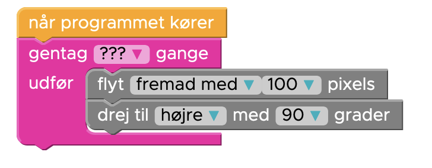

# Gentagelser

Lav [opgave 4 af Hour of Code med Elsa](https://studio.code.org/s/frozen/lessons/1/levels/4):

> Lad os lave et kvadrat med "Gentagelse" blokken, som bruger færre blokke. Hvor mange gange skal "Gentagelse" blokken, gentage blokkene indeni for at lave en firkant?


## Gentagelser i Python

Gentagelser i Python kan laves på flere forskellige måder. Fælles for dem er at 
man kalder dem for "Loops" eller på "løkker" på dansk.

Der er to forskellige måder at lave løkker i Python på som kaldes:
- For loops (for hver)
- While loops (så længe)

Vi benytter `for`.

I en for-løkke kan man bruge `range` til at bestemme hvor mange gentagelser man ønsker.

```python
for i in range(5):
```

Her gentages det under denne "blok" 5 gange.

## Indrykning

For at benytte den som en blok med noget indeni, ligesom gentag blokken i Hour of Code:



Så skal man indrykke sin tekst, så den kommer "ind under" sin for-løkke:

Dette er det samme kode i Python:

```python
for i in range(???):
    forward(100)
    right(90)
```

### Genvejstaster

1. Marker noget tekst med Shift og piletasterne
2. tryk Tab, eller Shift+Tab for at rykke teksten ind eller ud.

## Prøv selv gentagelser

Kan du tegne en firkat med for-løkken:

```python.run
from turtle import *

for i in range(???):
  forward(100)
  right(90)

done()
```
