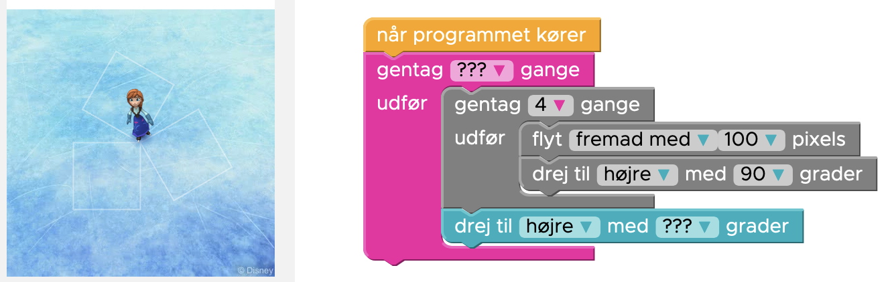

# Løkker i Løkker

## Opgave 5

Fortsæt med [opgave 5 Hour of Code med Elsa](https://studio.code.org/s/frozen/lessons/1/levels/5)

> Lad os lave tre kvadrater, og dreje efter hvert kvadrat. Sørg for at at dreje 120 grader før hvert nyt kvadrat.


### Opgave 5 i Python

Husk at indrykning er vigtig. Nu skal vi have to løkker inde i hindande, ligesom
i Hour of Code.



Så skal vi have den første løkke indrykket én gang, og det i den anden løkke to 
gange. Se koden her, og gør det selv færdigt.

```python
from turtle import *

for i in range(???):
    for j in range(4):
        forward(100)
        right(90)
    right(??)

done()
```
