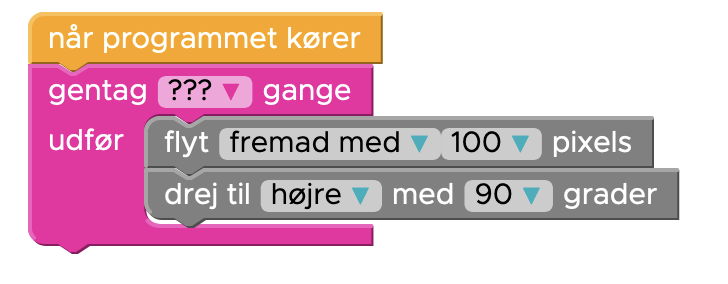

## Lektion 1


### Install Thonny


### Hello World

Sikre at det virker.

Brug print til at skrive "Hallo Verden"

```python
# Dette er en kommentar,
# python er ligeglad med hvad jeg skriver her
# du behøver ikke skriver hvad du ser af kommentarer

print("Hallo Verden")
```

### Save As...

Gem ofte, gerne hver gang vi skifter til ny level, så valg, File og Save As, og navngiv filen "Elsa1.py" og skift tallet ud med hver level :)

### Start Hour of Code med Elsa and Anna


https://hourofcode.com/frzn

Se videoen og lav level 1, 2, og 3

### Intro til Turtle

Tilbage i Thonny

Introducer Turtle

```python
from turtle import *

forward(100)
right(90)

# Lav en firkant, ligesom i Hour of Code

done()

```


### Fortsæt Hour of Code with Elsa and Anna (Level 4)

Into til Loops

https://studio.code.org/s/frozen/lessons/1/levels/4

Gør level 4 færdig

### Level 4 i Python


Forklar om `range` løkken i Python
Forklar om indentering og sammenligningen med Blocks som har noget "under" sig.


Det samme kode i Python

```python
from turtle import *

for i in range(???):
    forward(100)
    right(90)

done()

```


### Fortsæt Hour of Code with Elsa and Anna (Level 5)

https://studio.code.org/s/frozen/lessons/1/levels/5

Loops in loops

### Level 5 i Python

Forklar om indentering igen


Det samme kode i Python

Gør det selv færdigt

```python
from turtle import *

for i in range(???):
    for j in range(4):
        forward(100)
        right(90)
    right(??)

done()

```

### Fortsæt Hour of Code with Elsa and Anna (Level 6)

https://studio.code.org/s/frozen/lessons/1/levels/6

Lav et snefnug

### Level 6 i Python

10 firkanter, 36 grader imellem

Det samme kode i Python

Gør det selv færdigt

```python
from turtle import *

for i in range(???):
    for j in range(4):
        forward(100)
        right(90)
    right(??)

done()

```

### Fortsæt Hour of Code with Elsa and Anna (Level 7)

https://studio.code.org/s/frozen/lessons/1/levels/7

Lav et kryds

### Level 7 i Python

Husk hvordan en løkke ser ud

```python
for i in range(???):
```

Forklar om TAB og Shift-TAB for ar indrykke og rykke ud

Gør det selv færdigt

```python
from turtle import *

forward(100)
back(100)
right(90)

done()

```

HINT:

```python
for i in range(4):
    forward(100)
    back(100)
    right(90)
```

### Fortsæt Hour of Code with Elsa and Anna (Level 8)

https://studio.code.org/s/frozen/lessons/1/levels/8

Lav en stjerne, 10 gentagelser.
Hvor mange grader, når der er 360 grader i en hel cirkel

### Level 8 i Python


Husk hvordan en løkke ser ud

```python
for i in range(???):
```

Gør det selv færdigt

```python
from turtle import *

forward(100)
back(100)
right(???)

done()

```

HINT:

```python
for i in range(10):
    forward(100)
    back(100)
    right(???)
```
