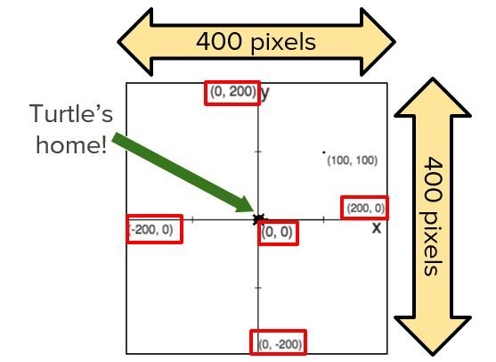
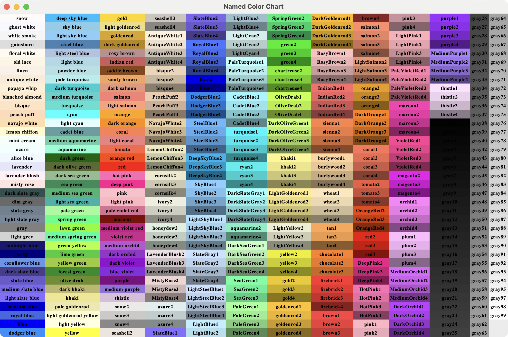

# Tegn frit


Fortsæt [opgave 20 i Hour of Code med Elsa and Anna](https://studio.code.org/s/frozen/lessons/1/levels/20)

> Du er nu officielt en stor kunstner! Lav et vinterdrømmeland.


## Opgave 20 i Python

Lav lige hvad du har lyst til. Prøv at samle den kode du har lavet, og lav nogle genbrugelige funktioner, som kan tegne de forskellige typer snefnug.

## Udfordringer

### Skift Baggrundsfarve

Elsa og Anna's skøjtebane ser bedre ud end det hvide canvas vi har.

```python
screen = Screen()
# Lav mere plads på canvaset
screen.setworldcoordinates(-500,-500,500,500)
# Prøv at ændre baggrundsfarven
screen.bgcolor("RoyalBlue")
```

### Funktioner til det I har lavet

Prøv at lave snefnug funktioner ud af de forskellige typer:

- firkanter (opgave 6)
- streger (opgave 9)
- parallelogram (opgave 12)
- spiral (opgave 15)
- blomst (opgave 17)
- fraktal (opgave 19)

f.eks. en snefnugfunktion af firkant typen:

```python
def snefnug_firkant():
    for i in range(10):
        for j in range(4):
            forward(100)
            right(90)
        right(36)
```

### Teleport funktion

Turtle benytter et koordinatsystem som dette:



Denne teleport funktion, flytter Turtle til det givne koordinat på canvaset, uden at tegne en streg. 

```python
# Funktion til at flytte turtle's position
def teleport(x, y):
    penup()
    goto(x, y)
    pendown()
```

### Leg med farver

Se alle farverne i Python her:


Det er ikke alle som er tilgængelig i Trinket. Se Trinket's farver her:

https://trinket.io/docs/colors

```python
# Husk import random
import random

# Liste med dine yndlingsfarver
color_names = ["sky blue", "light blue", "turquoise", "cyan", "slate blue", "medium orchid", "magenta", "aquamarine"]

# Lav en funktion, så det er nemmere at få en tilfældig farve
def nyfarve(): return random.choice(color_names)

# brug farven
color(nyfarve())
```

## Eksempel

Her er noget at lege ud fra.

```python
from turtle import *
import random

color_names = ["white", "sky blue", "light blue", "turquoise", "cyan", "slate blue", "medium orchid", "magenta", "aquamarine"]

def nyfarve(): return random.choice(color_names)

# Prøv at ændre baggrundsfarven
screen = Screen()
screen.setworldcoordinates(-500,-500,500,500)
screen.bgcolor("RoyalBlue")


def hopfrem(trin):
    penup()
    forward(trin)
    pendown()


def opret_snefnuggren():
    hopfrem(90)
    left(45)
    for d in range(3):
        for g in range(3):
            forward(30)
            back(30)
            right(45)
        left(90)
        back(30)
        left(45)
    right(45)


def snefnug_fraktal():
    # Find din kode fra opgave 18 (Snufnug af fraktal)
    erstat = 0


def snefnug_firkant():
    # Find din kode fra opgave 6 (Snufnug af fraktal)
    erstat = 0


def snefnug_parallelogram():
    # Find din kode fra opgave 12
    erstat = 0


def snefnug_streger():
    # Find din kode fra opgave 9
    erstat = 0


# Tilføj de resterende

# Ny funktion til at flytte turtle positionen
def teleport(x, y):
    penup()
    goto(x, y)
    pendown()


speed(0)

teleport(-200,-200)
color(nyfarve())
snefnug_parallelogram()

teleport(200,-200)
color(nyfarve())
snefnug_fraktal()

teleport(-200,200)
color(nyfarve())
snefnug_firkant()

teleport(200,200)
snefnug_streger()

done()
```


## Udfordringer

### Størrelse

Prøv om du kan lave så funktionerne tager en størrelse som parameter, i stedet for de alle laver streger som er 100-pixel lange.

F.eks. med firkaten:

```python
def snefnug_firkant(size):
    for i in range(10):
        for j in range(4):
            forward(size)
            right(90)
        right(36)


# tegn et mindre snefnug:
snefnug_firkant(50)
```
