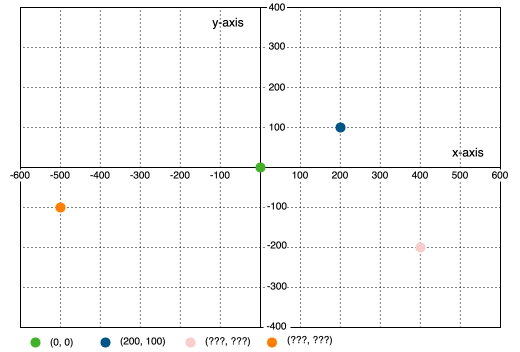
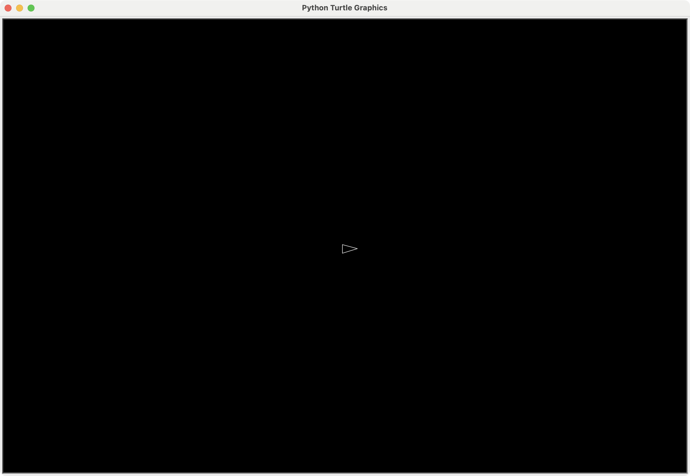

# Python Game Development

## Asteroids

med Turtle Graphics

---

# Lad os installere et IDE

> Integrated Development Environment

## PyCharm Community Edition: 
- https://www.jetbrains.com/pycharm/download/

### Og gør jer klar til at kode

- Hav et projekt klar i dit IDE
- Lav en ny fil, f.eks. `asteroids.py`

---

# Turtle's 
# koordinat system



---

# Vi starter med at importere turtle

så vi kan bruge den i vores kode

```python
import turtle
```

---

# Lad os definere nogle konstanter

Det gør det nemmere at justere spillet senere hen

```python
#
#  CONSTANTS
#

SCREEN_WIDTH = 1200 # Bredden på skærmbilledet
SCREEN_HEIGHT = 800 # Højden
BG_COLOR = "black" # Baggrundsfarven
```

En konstant er en slags variabel, men som ikke ændrer sig mens programmet kører

---

# Bagefter sætter vi skærmen op

```python
#
#  GAME SETUP
#

# Set up the screen
screen = turtle.Screen()
screen.setup(SCREEN_WIDTH, SCREEN_HEIGHT) # width and height
screen.bgcolor(BG_COLOR) # background color
screen.tracer(0) # disable the built in movement animation of turtle
```

Det laver vinduet, sætter størrelsen og baggrundsfarven på det, og slår den indbyggede bevægelses-animation fra.

---

# Lad os lave et rumskib

```python
# Make a turtle for the player
player = turtle.Turtle()
player.shape("triangle")
player.color("light grey", BG_COLOR)
player.shapesize(stretch_wid=0.75, stretch_len=1.5) # Stretch the triangle to be pointy
player.penup() # to not draw lines
```

- Her bruger vi en `triangle` shape til vores turtle, sætter den til lysegrå med sort fyld.
- Derefter strækker vi den i længden så den ligner mere et rumskib
- Til sidst løfter vi pen'en, så den ikke tegner streger efter sig.


---

# Lad os se vores spil

```python
#
#  START THE GAME
#

screen.update() # Since we disabled the tracer, we manually have to update the screen
screen.mainloop() # don't close the window
```

- Nu skal vi opdatere skærmen med det vi har sat på den: rumskibet.
- Det skal vi selv gøre fordi vi har slået `tracer` (aninationen) fra.
- Og den sidste linie i koden kalder vi `mainloop` funktionen, så programmet ikke stopper


---

# _     Ser det sådan ud?

