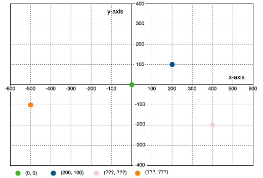

<style>
.container{
    display: flex;
}
.col{
    flex: 1;
}
</style>
<!-- need to enable HTML in the MARP extension -->

# Asteroids Game

## Wrap Player

## Har I prøvet at flyve lidt ?

## Er der noget galt ?

---

# Kan I huske 
# koordinat systemet ?



---

# Kan I huske skærmens størrelse ?

```python
SCREEN_WIDTH = 1200
SCREEN_HEIGHT = 800
```

## Hvordan finder vi halvdelen ?

---

# Lad os gemme det i en konstant

```python
HALF_WIDTH = int(SCREEN_WIDTH / 2)
HALF_HEIGHT = ???
```

`int` funktionen laver et decimaltal `600.0` til et heltal `600`

---

# Lad os lave en funktion til at flytte en turtle

Vi skal nemlig ikke kun flytte rumskibet.

Vi skal også flytte asteroider.

Funktioner gør så vi kan genbruge algoritmen.

---

# Kan I huske funktioner?

Det er lidt ligesom

* Omkvædet i en sang
* Ligesom opskrifter

Men vidste I en funktion kan tage parametre?

---

# Eksempler på parametre i funktioner

```python
turtle.forward(100)
turtle.right(90)
```

Hvordan laver vi selv sådan en funktion ?

---

# Eksempler på definitioner

```python
# En funktion uden parametre
def chorus():
   print("doo doo, doo doo doo doo")

# En funktion med en parameter
def verse(person):
   for i in range(4):
       print(person + " Shark")
       chorus()

for p in ("Baby", "Mommy"):
    verse(p)
```

---

# Vores funktion til at flytt en turtle

```python
def move_if_out_of_bounds(t: turtle.Turtle):
```

`t` er navnet på en variabel
`turtle.Turtle` er et type-hint, som man kan bruge til at fortæ

---

# Hvad skal vi så have indeni ?

Lad os hente z og y koordinaterne fra turtle

```python
    x = t.xcor()
    y = t.ycor()
```

Og i pseudo kode skal vi bruge noget ala dette:

```python
    if x is too far right:
        t should goto left side of screen
    elif x is too far left:
        t should goto right side of screen
```
Og det samme med op og ned.

---

# Hvordan ved vi om x er for langt til højre eller til venstre ?

* Vi har `x` og vi har `HALF_WIDTH`
* Hvordan sammenligner vi dem ?
* `x` er større end `HALF_WIDTH`
* `x` er mindre end `-HALF_WIDTH`
