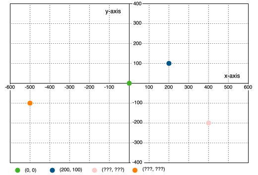
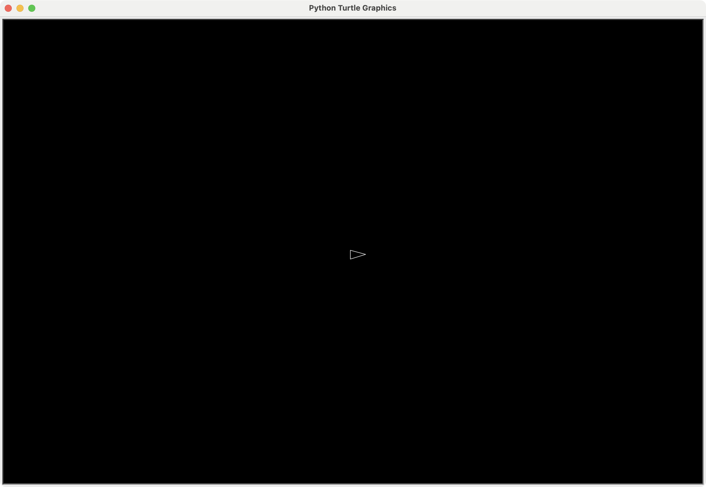

# Python Game Development

## Asteroids

med Turtle Graphics

---

# Lad os installere et IDE

> Integrated Development Environment

## PyCharm Community Edition: 
- https://www.jetbrains.com/pycharm/download/

- ✅ Download PyCharm Community Edition (**ikke** Professional edition)
- ✅ Installer PyCharm Community Edition

### Og gør jer klar til at kode

- ✅ Lav et nyt projekt i PyCharm

Hvis ikke I har Python installeret, så vil PyCharm selv downloade en version. Hvis I bliver spurgt, så vælg Python 3.12

- ✅ Lav en ny fil, f.eks. `asteroids.py`

---

# Turtle's 
# koordinat system



---

# Lad os holde orden i tingene

## Opdeling af koden i sektioner

1. Imports øverst
2. Definere konstanter
3. (Classes) - kommer senere
4. Game setup
5. Events
6. Behaviours
7. (Game Loop)
8. Start the game

## F.eks. således i Python

```python
import turtle
# CONSTANTS, e.g.
SCREEN_WIDTH = 1200  # en konstant
# CLASSES, e.g.
class Asteroid(turtle.Turtle): 
# GAME SETUP, e.g.
player = turtle.Turtle()
# EVENTS, e.g.
screen.onkey(press_up, "Up")
# BEHAVIOURS, e.g.
def move_spaceship():
# GAME LOOP, e.g.
def update():
# START THE GAME, e.g.
screen.mainloop()
```


---

# Kommentarer

Alt efter et `#`-tegn betragtes som en kommentar, og ignoreres af Python.

I behøver ikke skrive dem, men de er en god hjælp til sig selv senere.

```python
#
#  GAME SETUP
#

player.penup() # to not draw lines
```

Hvis I skriver kommentarer, så skriv **hvorfor** og ikke **hvad**.
Jeg skriver måske lidt **hvad**, men for at hjælpe jer til bedre at forstå koden til at starte med.

---

# Lad os komme i gang

## Start med at importere turtle

så vi kan bruge den i vores kode

```python
import turtle
```

- ✅ Sæt koden ind i din tomme fil som første linie

---

# Lad os definere nogle konstanter

Det gør det nemmere at justere spillet senere hen

En konstant er en slags variabel, men som ikke ændrer sig mens programmet kører

```python
#
#  CONSTANTS
#

SCREEN_WIDTH = 1200 # Bredden på skærmbilledet
SCREEN_HEIGHT = 800 # Højden
BG_COLOR = "black" # Baggrundsfarven
```

- ✅ Sæt koden ind efter `import` linien


---

# Bagefter sætter vi skærmen op

```python
#
#  GAME SETUP
#

# Set up the screen
screen = turtle.Screen()
screen.setup(SCREEN_WIDTH, SCREEN_HEIGHT) # width and height
screen.bgcolor(BG_COLOR) # background color
screen.tracer(0) # disable the built in movement animation of turtle
```

Det laver vinduet, sætter størrelsen og baggrundsfarven på det, og slår den indbyggede bevægelses-animation fra.


- ✅ Sæt koden ind efter `# CONSTANTS` sektionen, dvs. efter alle konstanterne

---

# Lad os lave et rumskib

```python
# Make a turtle for the player
player = turtle.Turtle()
player.shape("triangle")
player.color("light grey", BG_COLOR)
player.penup() # to not draw lines
```

- Her bruger vi en `triangle` shape til vores turtle, sætter den til lysegrå med sort fyld.
- Til sidst løfter vi pen'en, så den ikke tegner streger efter sig.

- ✅ Sæt koden ind i `# GAME SETUP` sektionen, efter `screen` er sat op


---

# Lad os se vores spil

```python
#
#  START THE GAME
#

screen.update() # Since we disabled the tracer, we manually have to update the screen
screen.mainloop() # don't close the window
```

- Nu skal vi opdatere skærmen med det vi har sat på den: rumskibet.
- Det skal vi selv gøre fordi vi har slået `tracer` (aninationen) fra.
- Og den sidste linie i koden kalder vi `mainloop` funktionen, så programmet ikke stopper

- ✅ Sæt koden ind efter `# GAME SETUP` sektionen, dvs. efter både `screen` og `player` er sat op

---

# Prøv spillet

- ✅ Kør spillet og se hvordan det ser ud

## Ser det sådan ud?



---

# Samlet set

```python
import turtle

#
#  CONSTANTS
#
SCREEN_WIDTH = 1200
SCREEN_HEIGHT = 800
BG_COLOR = "black"

#
#  GAME SETUP
#
screen = turtle.Screen()
screen.setup(SCREEN_WIDTH, SCREEN_HEIGHT)
screen.bgcolor(BG_COLOR)
screen.tracer(0)  # disable animation

# Make a turtle for the player
player = turtle.Turtle()
player.shape("triangle")
player.color("light grey", BG_COLOR)
player.penup()  # to not draw lines


#
#  START THE GAME
#

screen.update()
screen.mainloop()

```

---

# Skal vi have rumbkibet til at se lidt bedre ud ?

Det kan vi gøre ved at strække lidt i trekanten:

```python
# Stretch the triangle to be pointy
player.shapesize(stretch_wid=0.75, stretch_len=1.5)
```

- Her strækker vi den i længden så den ligner mere et rumskib

Man kan også gøre det kortere:
```python
player.shapesize(0.75, 1.5)
```

- ✅ Sæt koden ind i `# GAME SETUP` sektionen, efter de andre `player`-linier

---
