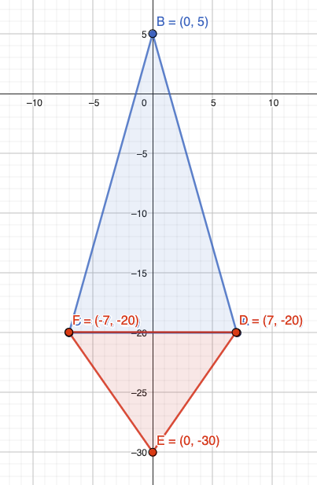
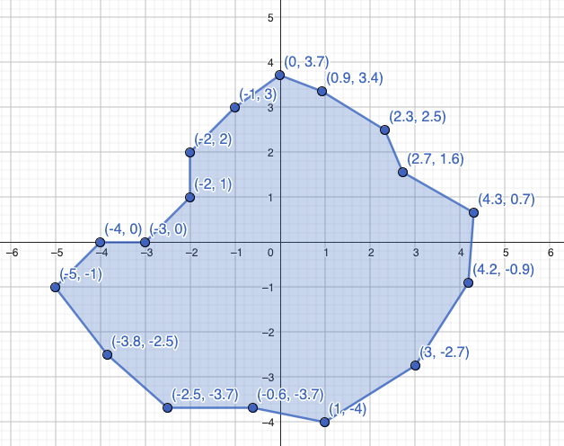

# Lav rumskib formen om

Den ser sådan ud nu:



Lav evt. jeres egen form her: https://www.geogebra.org/geometry


```python
# CONSTANTS

SPACESHIP_SHAPE = ( (7,-20), (0,5), (-7,-20) )
SPACESHIP_THRUST_SHAPE = turtle.Shape('compound')
SPACESHIP_THRUST_SHAPE.addcomponent(SPACESHIP_SHAPE, BG_COLOR, 'light grey')
SPACESHIP_THRUST_SHAPE.addcomponent(( (7,-20), (0,-30), (-7,-20) ), BG_COLOR, 'orange')
```

Eller brug en af de indbyggede forme:

- arrow
- turtle
- circle
- square
- triangle
- classic

Og sæt den i `Player.__init__` og `animate_spaceship`

```python
# Player.__init__

        self.shape("spaceship")


# animate_spaceship

    if keys_pressed["Up"]:
        player.shape("spaceship_thrust")
    else:
        player.shape("spaceship")

```

# Skyd med laser

Gør `Bullet` helt vildt lang!

```python
self.shapesize(0.1, 10)
```

# Asteroide agtig form

Brug denne `ASTEROID_SHAPE`, eller lav din egen her: https://www.geogebra.org/geometry




```python
#  CONSTANTS

ASTEROID_SHAPE = ( (-5,-1), (-4,0), (-3,0), (-2,1), (-2,2), (-1,3), (0,3.8), (1,3.2), (2.2,2.3), (2.4,1.5), (4.2,0.7), (4.1,-1), (3,-2.8), (1,-3), (-0.6,-3.8), (-2.5,-3.8), (-4,-2.5), (-5,-1) )

# GAME SETUP

screen.register_shape("asteroid", ASTEROID_SHAPE)


# Asteroid.__init__

        self.shape("asteroid")
        self.shapesize(5, 5)

```


# Drej asteroiden rundt når den flyver


```python

# def move_asteroids():

            asteroid.tilt(asteroid.speed)

```
