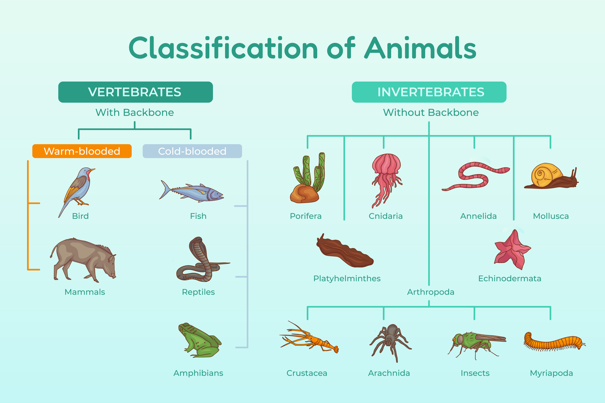

<style>
.container{
    display: flex;
}
.col{
    flex: 1;
}
</style>
<!-- need to enable HTML in the MARP extension -->

# Asteroids Game

## Skyde en kugle


---

# Nu skal vi lære om

* Classes

... og få rumskibet til at skyde

---

# Kender I Classes i programmering?

* Hvad tænker I når I hører det?
* Har I hørt om klassificeringer ?
* F.eks. i dyreriget?
* Hvirveldyr er en klassificering af dyr med rygrad.
* Varm-blodige dyr er en klassificering af dyr med rygrad.
* Pattedyr er en klassificering af varmblodige dyr

---



by <a href="https://www.freepik.com/free-vector/hand-drawn-classification-animals-infographic_26526557.htm">Freepik</a>

---

# Classes i programmering er lidt det samme

* Det definerer en entitet som deler nogle egenskaber
* F.eks. om det har en rygrad eller ej, elle om det er varmblodigt.


<div class="container">

<div class="col">

```python


```

</div>

<div class="col">

```python


```

</div>

</div>


